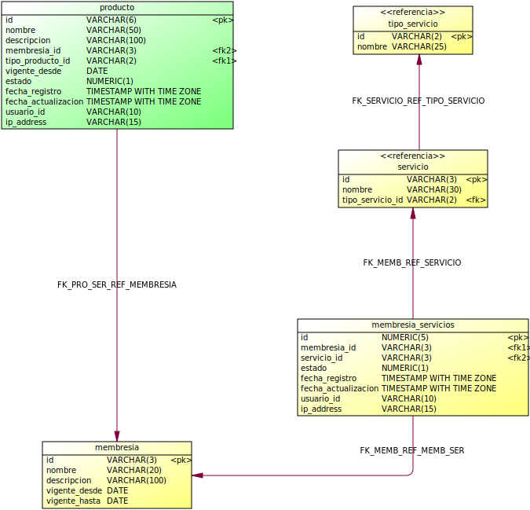
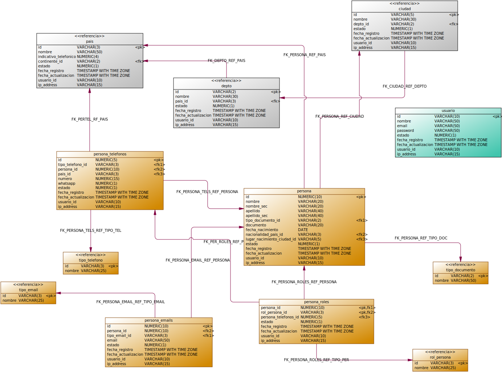

# InRoute-DB

Estructura Repositorio

## Data
Informacion para cargar en la base de datos, ver aqui [Data](./Data)

## Diagramas
Modelos entidad relacion de cada uno de los dominios de la base de datos del proyecto InRoute, ver aqui [Diagrams](./Diagrams)

| Dominio        | Diagrama                                                          |
| -------------- | ----------------------------------------------------------------- |
| Entrenamiento  |   |
| Facturacion    |       |
| Geografico     |         |
| Membresia      |           |
| Persona        |               |

## Scripts
Scripts para crear la base de datos y cargar informacion, ver aqui [Scripts](./Scripts)

Para hidratar el modelo de datos, es necesario generar el archivo init-db.sql.gz y posteriormente lanzar la base de datos, para lo cual se debe ejecutar lo siguiente:
```sh:
./run-createdata.sh
./run-postgres.sh
```