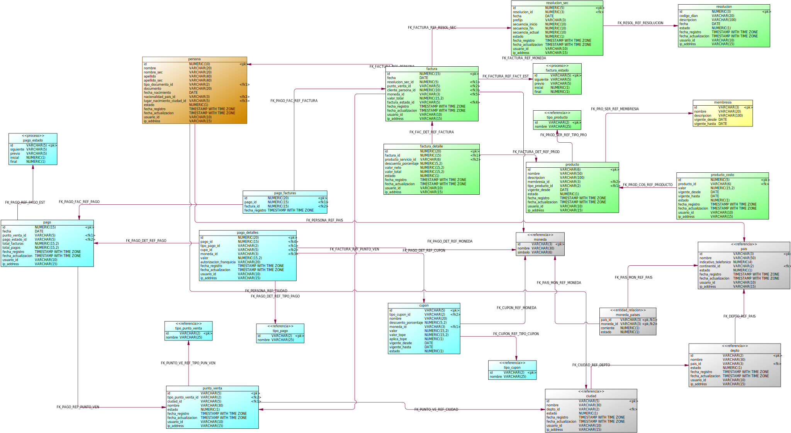

# InRoute-DB

Estructura Repositorio

## Data
Informacion para cargar en la base de datos.

## Diagramas
Modelos entidad relacion de cada uno de los dominios de la base de datos del proyecto InRoute.

| Dominio        | Diagrama                                                          |
| -------------- | ----------------------------------------------------------------- |
| Entrenamiento  |  |
| Facturacion    |      |
| Membresia      |          |
| Persona        |              |

## Scripts
Scripts para crear la base de datos y cargar informacion.
